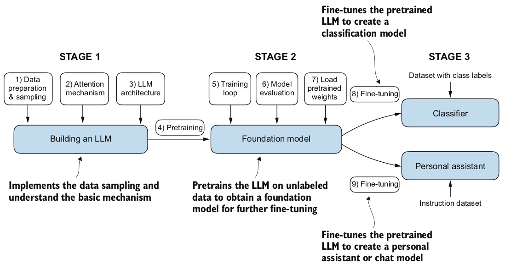
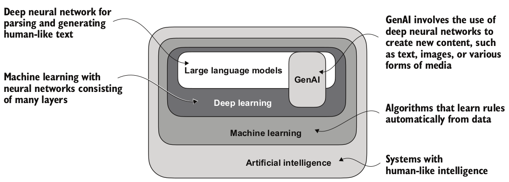

Build your own llm.

<!-- # Build a Large Language Model

- Large Language Model: a deep neural network model trained on massive amounts of text data with a large number of parameters and the immense dataset on which it’s trained

- Model's Parameters: the adjustable weights in the network that are optimized during training to predict the next word in a sequence

- Transformer: LLM's architecture that allowes it to pay selective attention to different parts of the input when making predictions, making them especially adept at handling the nuances and complexities of human language

- Language models “understand” means -> they can process and generate text in ways that appear coherent and contextually relevant, not that they possess human-like consciousness or comprehension.

 -->
